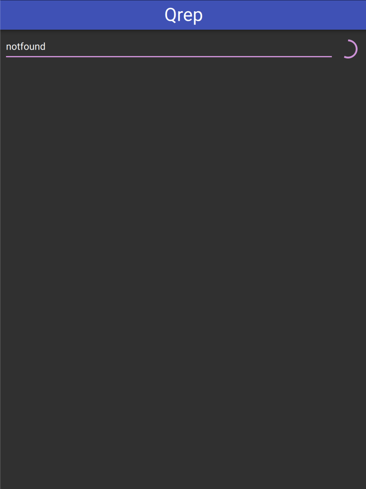

# Rust program + Qt

To run these examples you need to have Qt (5) installed.


## Linking Qt Dynamically

```bash
# on MacOS
$ make debug
$ make rpath_debug # Fixes LC_RPATH to include Qt
$ make run_debug

# on other platforms
$ make run_debug
```

## Linking Qt Statically

You first need to build Qt statically: https://retifrav.github.io/blog/2018/02/17/build-qt-statically/.

Then uncomment the 1 line following `// static` in [src/main.rs](src/mains.rs).

```bash
$ make clean_qt
$ QMAKE=[PATH TO STATIC QMAKE] QT_STATIC=1 make run_debug
# e.g. QMAKE=~/Qt/static/5/bin/qmake QT_STATIC=1 make run_debug
```

## Run `qmlscene`

```bash
$ cd src/cpp
$ QT_QUICK_CONTROLS_STYLE=material qmlscene -I qml_modules main.qml
```

## Screenshots




## Troubleshooting

### Cocoa plugin not found
```
qt.qpa.plugin: Could not find the Qt platform plugin "cocoa" in ""
This application failed to start because no Qt platform plugin could be initialized. Reinstalling the application may fix this problem.
```

Qt plugins have not been imported for static linking in Cpp. See https://doc.qt.io/QtForDeviceCreation/qtee-static-linking.html#adding-qml-imports


### Qt libs nout found by loader

* https://github.com/rust-lang/cargo/issues/5077
* https://github.com/rust-lang/rust/issues/17219
* https://wincent.com/wiki/@executable_path,_@load_path_and_@rpath


## License

From an original work by `Jos van den Oever <jos@vandenoever.info>`, AGPL-3.0-or-later, https://anongit.kde.org/scratch/vandenoever/qrep.
